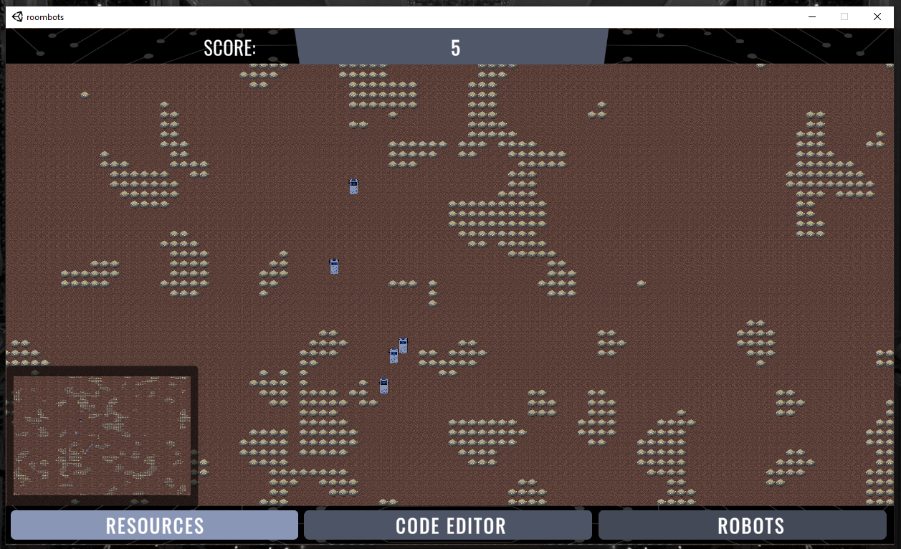

# Roombots

## An Educational, Multiplayer Programming Game

Roombots is a game where players terraform a planet by writing robot code!

The project consists of two repos: game client and server.

The server can be found here:

[https://github.com/SpaceRoombas/backend](https://github.com/SpaceRoombas/backend)

Binaries can be found under `releases`.

The game client can be cloned and built using Unity.